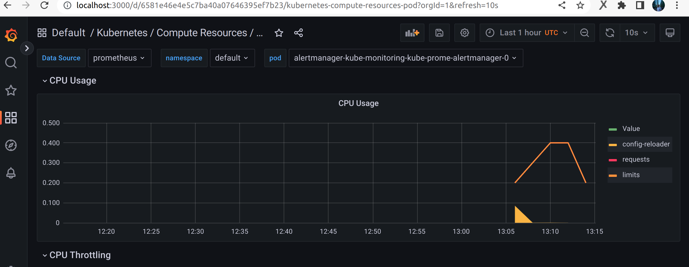
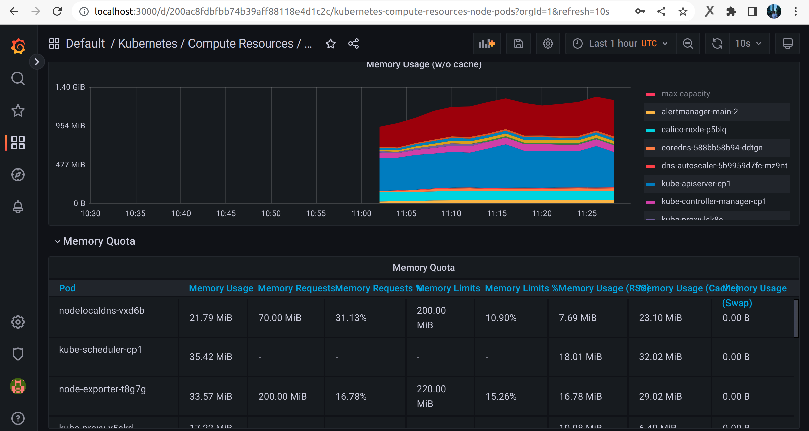
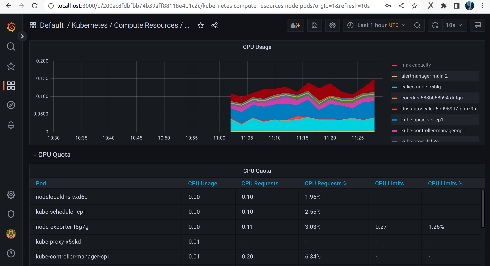
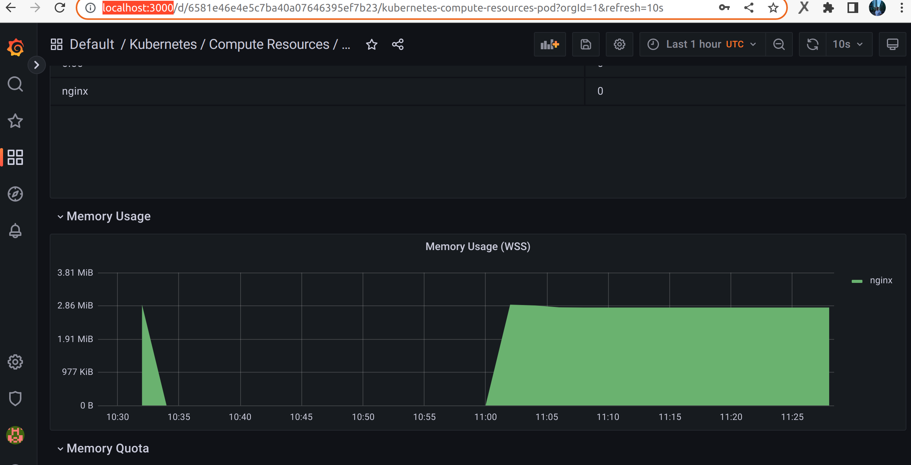

---
# Мой диплом
## Работа с Terraform

1. Для начала создаем сервисный аккаунт:

```bash
$ yc iam service-account create sa
id: 
folder_id: 
created_at: 
name: sa
```

Даем ему права на редактирование (заменяем наш каталог):

```bash
$ yc resource-manager folder add-access-binding b1g259gr1ck7ejh9jd55 --role editor --subject serviceAccount:aje2ac1v0gqi4mu633a3
done (1s)
```
Генерируем access и secret key:

```bash
$ yc iam access-key create --service-account-name sa
```

Добавляем ключи key_id и secret в main.tf

Создаем бакет:
```bash
$ yc storage bucket create --name my-storage
```

Инициализируем backend:
```bash
terraform init
```

Создаем два workspaces:
```bash
terraform workspace new prod
terraform workspace new stage
```

```bash
user@user:~/PycharmProjects/diplom$ terraform workspace list
  default
  prod
* stage
```

Конфигурация создаваемых машин описана в файлах папки Terraform.

Запуск сборки делаем с помощью команды:

```bash
terraform apply
```
## Работа с kubernetes
Установим кластер kubernetes с помощью kubespray.
```bash
$ yc compute instance list
+----------------------+-------+---------------+---------+----------------+---------------+
|          ID          | NAME  |    ZONE ID    | STATUS  |  EXTERNAL IP   |  INTERNAL IP  |
+----------------------+-------+---------------+---------+----------------+---------------+
| fhm3m1rf2b5iu4du5vpr | node2 | ru-central1-a | RUNNING | 158.160.51.173 | 192.168.10.14 |
| fhm76hnqare7irr180hq | cp1   | ru-central1-a | RUNNING | 158.160.58.140 | 192.168.10.20 |
| fhmvmf3bco9ucqu24j55 | node1 | ru-central1-a | RUNNING | 158.160.32.29  | 192.168.10.4  |
+----------------------+-------+---------------+---------+----------------+---------------+
```
Зайдем на control node, склонируем репозиторий kubespray и внесем свои параметры:
```bash
$ ssh ubuntu@158.160.58.140
$ git clone https://github.com/kubernetes-sigs/kubespray
$ sudo apt-get update
$ sudo apt install pip
```
```shell script
# Установка зависимостей
$ cd kubespray
$ sudo pip3 install -r requirements.txt

# Копирование примера в папку с вашей конфигурацией
$ cp -rfp inventory/sample inventory/mycluster

# Обновление Ansible inventory с помощью билдера 
declare -a IPS=(192.168.10.20 192.168.10.17 192.168.10.23)
CONFIG_FILE=inventory/mycluster/hosts.yaml python3 contrib/inventory_builder/inventory.py ${IPS[@]}

# 192.168.10.20 192.168.10.17 192.168.10.23 - адреса моих серверов
```

Билдер подготовит файл `inventory/mycluster/hosts.yaml`. Там будут прописаны адреса серверов, которые указали.
Остальные настройки нужно делать самостоятельно.

```bash
$ cat ~/kubespray/inventory/mycluster/hosts.yaml 
all:
  hosts:
    cp1:
      ansible_host: 192.168.10.23
      ip: 192.168.10.23
      access_ip: 192.168.10.23
      ansible_user: ubuntu
    node1:
      ansible_host: 192.168.10.17
      ip: 192.168.10.17
      access_ip: 192.168.10.17
      ansible_user: ubuntu
    node2:
      ansible_host: 192.168.10.20
      ip: 192.168.10.20
      access_ip: 192.168.10.20
      ansible_user: ubuntu
  children:
    kube_control_plane:
      hosts:
        cp1:
    kube_node:
      hosts:
        cp1:
        node1:
        node2:
    etcd:
      hosts:
        cp1:
    k8s_cluster:
      children:
        kube_control_plane:
        kube_node:
    calico_rr:
      hosts: {}
```
Копируем адрес control node для настройки в дальнейшем доступа с домашнего пк:

```bash
$ vim inventory/mycluster/group_vars/k8s_cluster/k8s-cluster.yml

#Прописываем в этот параметр:
supplementary_addresses_in_ssl_keys: [10.0.0.1, 10.0.0.2, 10.0.0.3, 158.160.59.76]
```

Добавим установку helm в наш кластер.

```bash
$ vim inventory/mycluster/group_vars/k8s_cluster/addons.yml
#Прописываем:
helm_enabled: true
```


Копируем приватный ключ ssh с хостовой машины на cp1 и раздаем права
```bash
$ ~/kubespray$ chmod 0700 /home/ubuntu/.ssh/id_rsa
```

Подключаемся к нодам по ssh и потом запускаем установку кластера:

```bash
ansible-playbook -i inventory/mycluster/hosts.yaml cluster.yml -b -v
```

```bash
mkdir -p $HOME/.kube
sudo cp -i /etc/kubernetes/admin.conf $HOME/.kube/config
sudo chown $(id -u):$(id -g) $HOME/.kube/config
```

```bash
$ kubectl version
WARNING: This version information is deprecated and will be replaced with the output from kubectl version --short.  Use --output=yaml|json to get the full version.
Client Version: version.Info{Major:"1", Minor:"25", GitVersion:"v1.25.6", GitCommit:"ff2c119726cc1f8926fb0585c74b25921e866a28", GitTreeState:"clean", BuildDate:"2023-01-18T19:22:09Z", GoVersion:"go1.19.5", Compiler:"gc", Platform:"linux/amd64"}
Kustomize Version: v4.5.7
Server Version: version.Info{Major:"1", Minor:"25", GitVersion:"v1.25.6", GitCommit:"ff2c119726cc1f8926fb0585c74b25921e866a28", GitTreeState:"clean", BuildDate:"2023-01-18T19:15:26Z", GoVersion:"go1.19.5", Compiler:"gc", Platform:"linux/amd64"}

$ kubectl get nodes
NAME    STATUS   ROLES           AGE     VERSION
cp1     Ready    control-plane   10m     v1.25.6
node1   Ready    <none>          8m38s   v1.25.6
node2   Ready    <none>          8m40s   v1.25.6

$ kubectl get pods --all-namespaces
NAMESPACE     NAME                                       READY   STATUS    RESTARTS       AGE
kube-system   calico-kube-controllers-75748cc9fd-84zc2   1/1     Running   0              7m59s
kube-system   calico-node-p5blq                          1/1     Running   0              9m13s
kube-system   calico-node-q2mr5                          1/1     Running   0              9m13s
kube-system   calico-node-rg9ww                          1/1     Running   0              9m13s
kube-system   coredns-588bb58b94-ddtgn                   1/1     Running   0              7m26s
kube-system   coredns-588bb58b94-dl6ws                   1/1     Running   0              7m2s
kube-system   dns-autoscaler-5b9959d7fc-mz9nt            1/1     Running   0              7m18s
kube-system   kube-apiserver-cp1                         1/1     Running   1              11m
kube-system   kube-controller-manager-cp1                1/1     Running   2 (5m7s ago)   11m
kube-system   kube-proxy-4xtg2                           1/1     Running   0              10m
kube-system   kube-proxy-hk2q7                           1/1     Running   0              10m
kube-system   kube-proxy-klvbv                           1/1     Running   0              10m
kube-system   kube-scheduler-cp1                         1/1     Running   2 (5m7s ago)   11m
kube-system   nginx-proxy-node1                          1/1     Running   0              9m1s
kube-system   nginx-proxy-node2                          1/1     Running   0              9m2s
kube-system   nodelocaldns-jqxlq                         1/1     Running   0              7m17s
kube-system   nodelocaldns-shlcc                         1/1     Running   0              7m17s
kube-system   nodelocaldns-vxd6b                         1/1     Running   0              7m17s

$ kubectl create deploy nginx --image=alexeiemelin/nginx:v1
deployment.apps/nginx created

$ kubectl get po -o wide
NAME                     READY   STATUS    RESTARTS   AGE   IP               NODE    NOMINATED NODE   READINESS GATES
nginx-868dbbcfb9-ks74h   1/1     Running   0          19s   10.233.102.130   node1   <none>           <none>
```
Добавим доступ к ноде с домашнего пк. Для этого создадим и заполним context
```bash
$ vim ~/.kube/config 

#Cкопируем раздел cluster и user с ноды, поменяем адрес с localhost на внешний
apiVersion: v1
clusters:
- cluster:
    certificate-authority-data: 
    server: https://158.160.59.76:6443
  name: kubespray
contexts:
- context:
    cluster: kubespray
    namespace: default
    user: kubespray
  name: kubespray

users:
- name: kubespray
  user:
```

```bash
#Применим настройки и проверим доступ
$ kubectl config use-context kubespray
Switched to context "kubespray".

$ kubectl get nodes
NAME    STATUS   ROLES           AGE     VERSION
cp1     Ready    control-plane   3d23h   v1.25.6
node1   Ready    <none>          3d23h   v1.25.6
node2   Ready    <none>          3d23h   v1.25.6
```

Добавляем сервис для доступа из внешней сети и создаем deployment:
```bash
$ kubectl apply -f deployment.yml 
deployment/frontend created
service/nodeport created

$ kubectl get po -o wide
NAME       READY   STATUS    RESTARTS   AGE     IP               NODE    NOMINATED NODE   READINESS GATES
frontend   1/1     Running   0          2m27s   10.233.102.136   node1   <none>           <none>
```
```bash
#Проверяем доступность:
$ curl http://130.193.50.53:32180/
```

```html
<!doctype html>
<html lang="en">
<head>
  <meta charset="utf-8">
  <title>my_site</title>
</head>
<body>
  <h2>Welcome to my site</h2>
  <p>Alexei Emelin</p>
</body>
```
## Работа с Docker

Создаем наш docker image из Dockerfile:
```bash
docker build -t alexeiemelin/nginx:v1 .
```

И загружаем его на hub.docker:
```bash
docker push alexeiemelin/nginx:v1
```

https://hub.docker.com/r/alexeiemelin/nginx

##Деплоим стек grafana/prometheus/node-exporeter:

Ставим через репозиторий или через helm

```bash
#Через репозиторий
git clone git@github.com:prometheus-operator/kube-prometheus.git
cd kube-prometheus
kubectl apply --server-side -f manifests/setup
kubectl wait \
	--for condition=Established \
	--all CustomResourceDefinition \
	--namespace=monitoring
kubectl apply -f manifests/
```

```bash
#Через helm:
helm repo add prometheus-community https://prometheus-community.github.io/helm-charts
helm install kube-monitoring prometheus-community/kube-prometheus-stack
```

На локальной машине запускаем проброс трафика для доступа к grafana:

```bash
kubectl --namespace monitoring port-forward svc/grafana 3000
```
Теперь можем зайти в админку через браузер:
```html
http://localhost:3000/
```




## Работа с helm

Устанавливаем helm на пк для того, чтобы сделать наш chart:
```bash
curl -fsSL -o get_helm.sh https://raw.githubusercontent.com/helm/helm/master/scripts/get-helm-3
chmod 700 get_helm.sh
./get_helm.sh
```

Cоздаем наш чарт:
```bash
helm create my_nginx
```

Удаляем лишние файлы, созданные автоматически и заменяем своими (values.yaml, Chart.yaml, deployment.yml):
```bash
rm -rf my_nginx/templates/*
```

Проверяем, что значения из файла values.yaml корректно подставляются: 
```bash
helm template my_nginx
```

Проверяем синтаксис:
```bash
helm lint my_nginx
```

Пакуем в архив наш chart:
```bash
helm package my_nginx -d charts
Successfully packaged chart and saved it to: charts/my_nginx-0.1.2.tgz
```

Генерируем индексный файл чарта, 
который содержит в себе перечень версий приложения, составленный на основе архива:
```bash
helm repo index charts
```

Создадим index.html файл, который будет лицевой страничкой нашего чарта:
```html
<!doctype html>
<html lang="en">
<head>
  <meta charset="utf-8">
  <title>my_site</title>
</head>
<body>
  <h2>Welcome to my Helm repository</h2>
  <p>Alexei Emelin</p>
</body>
</html>
```

Верифицируем наш репозиторий. Для этого изменим наше приложение и загрузим новую версию.

Создаем наш docker image из Dockerfile:
```bash
docker build -t alexeiemelin/nginx:0.0.3 .
```

И загружаем его на hub.docker:
```bash
docker push alexeiemelin/nginx:0.0.3
```

Изменим значение версии в values.yaml и Chart.yaml

Перезальем наш chart:
```bash
helm package my_nginx -d charts
Successfully packaged chart and saved it to: charts/my_nginx-0.0.3.tgz
```

Добавляем на control node репозиторий helm и устанавливаем chart:
```bash
$ helm repo add my_nginx https://alexeiemelin.github.io/nginx_helm/charts/
$ helm install nginx my_nginx/my_nginx
NAME: nginx
LAST DEPLOYED: Wed Feb  8 15:00:55 2023
NAMESPACE: default
STATUS: deployed
REVISION: 1
TEST SUITE: None
```


## Работа с gitlab ci-cd
В конфиге terraform у нас уже подготовлена вм для gitlab с образом от yandex.
Настраиваем gitlab и gitlab runner по инструкции от yandex cloud:
https://cloud.yandex.ru/docs/tutorials/testing/ci-for-snapshots

Создаем на gitlab репозиторий и загружаем туда наш Dockerfile.
Создаем файл .gitlab-ci.yml
Он содержит pipeline, который при коммите в репозиторий запускает сборку образа приложения 
и пушит его в docker hub

При публикции новой версии нам останется изменить версию в файлах helm (values.yaml, Chart.yaml)
Перезалить helm chart и обновить приложение в kubernetes:
```bash
#В репо с нашим приложением
helm package my_nginx -d charts
helm repo index charts

#В kubernetes
helm repo update
helm upgrade --install nginx my_nginx/my_nginx
```
